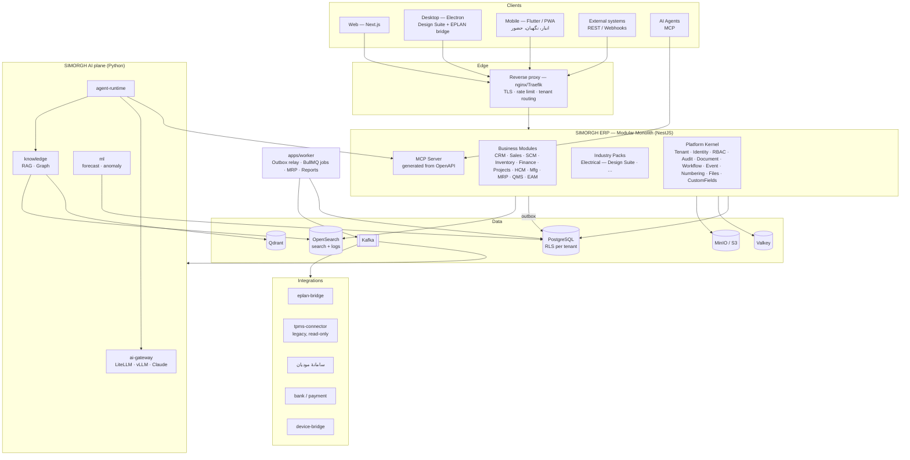
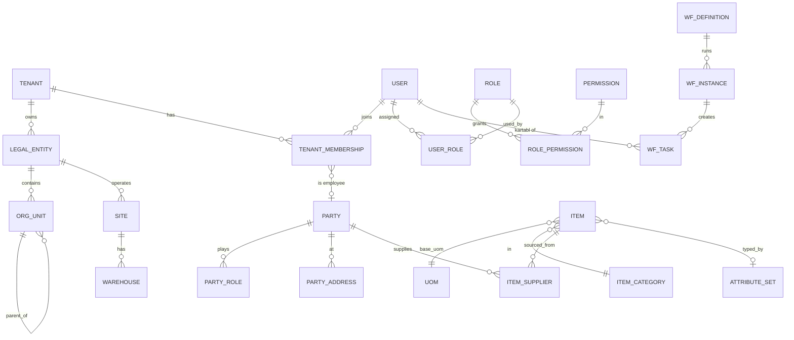
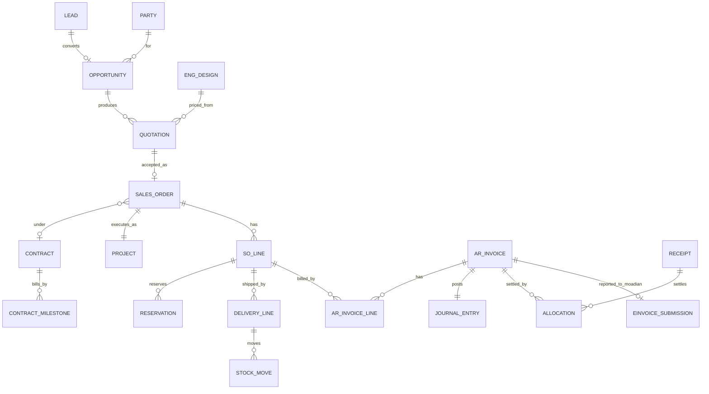
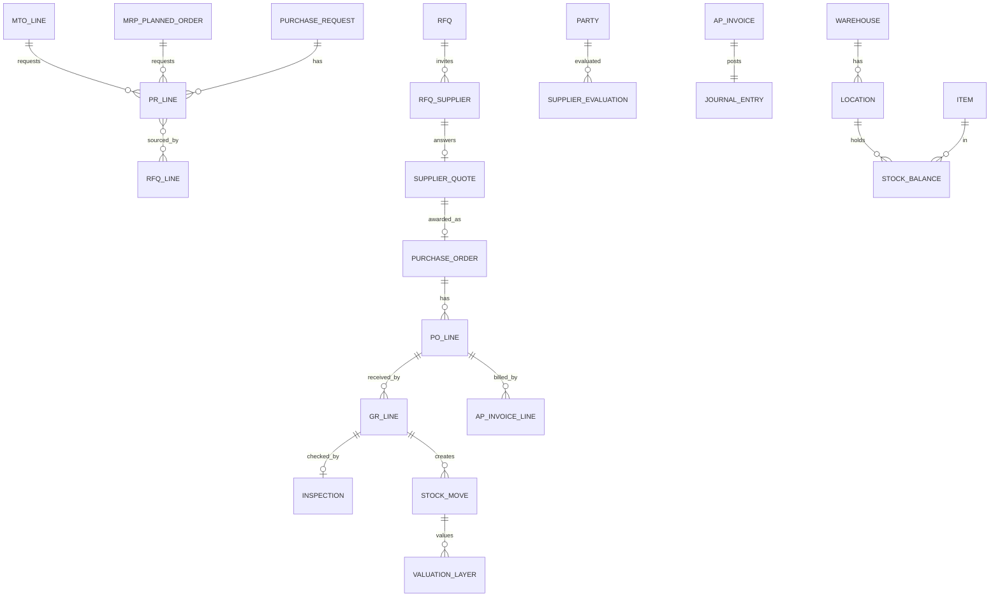
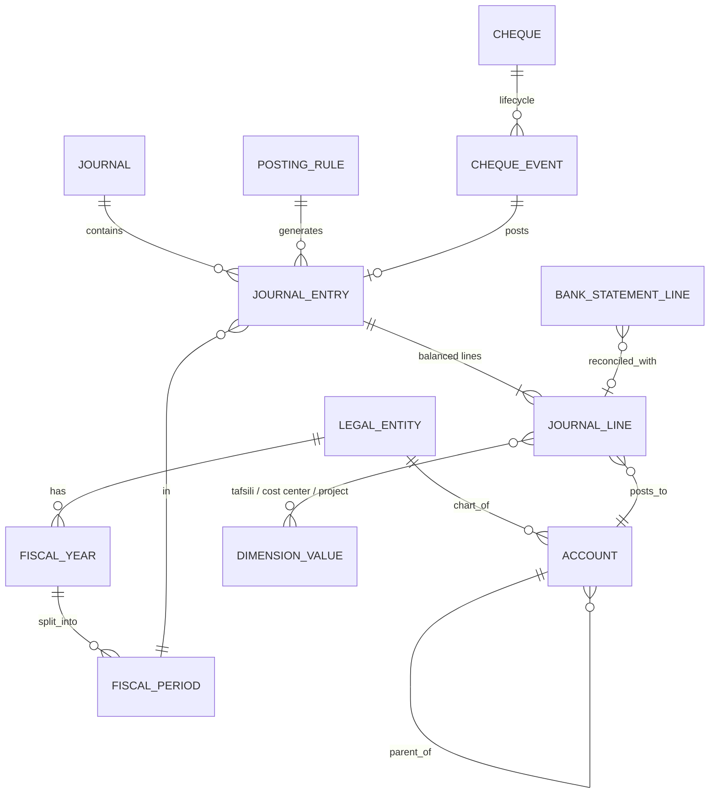
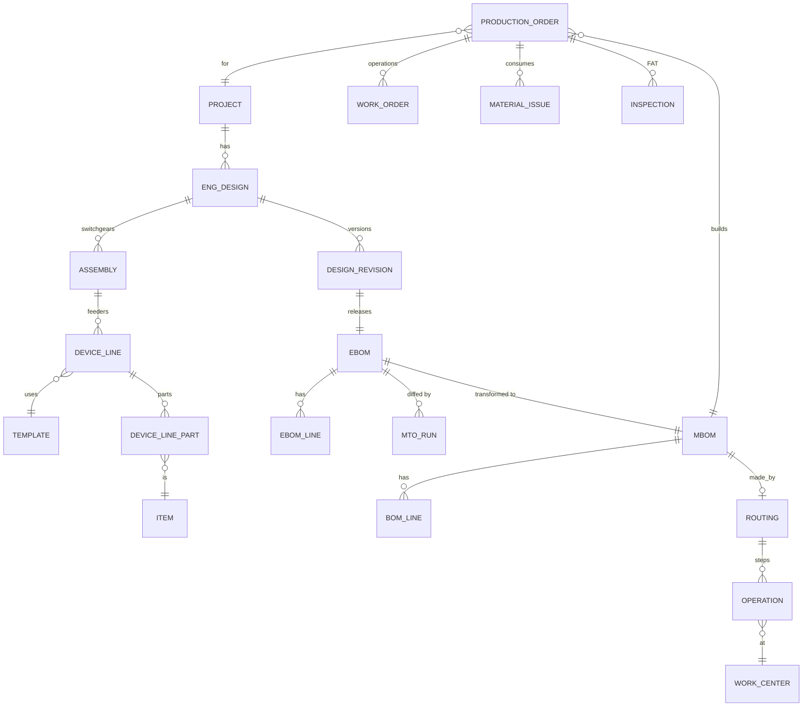
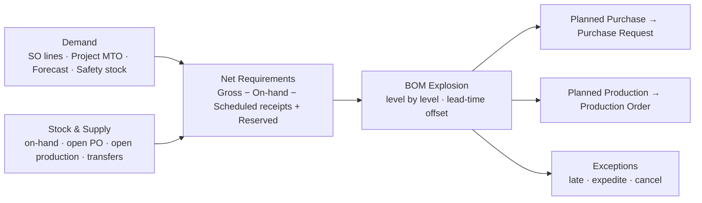
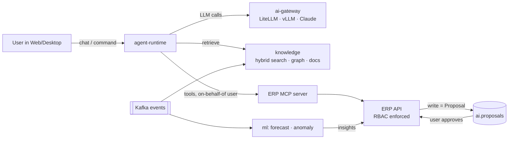

# SIMORGH ERP — Enterprise Architecture v1.0

| | |
|---|---|
| **وضعیت** | پیش‌نویس برای تصویب |
| **تاریخ** | ۱۴۰۵/۰۷/۰۷ — 2026-09-29 |
| **دامنه** | کل خانوادهٔ محصول SIMORGH ERP (Core، ماژول‌ها، Design Suite، AI، Twin) |
| **مبنا** | بررسی مستقیم کد: `simorgh-chatbot-ekc-deploy` @ `claude/nifty-keller-0t006m`، `SIMORGH-KARA` @ `main`، `simorgh-ledger` @ `main` |
| **پیوست‌ها** | [A — فهرست کد فعلی و حکم هر بخش](./appendix-A-code-inventory.md) · [B — DDL هستهٔ دیتابیس](./appendix-B-core-schema.sql) |

> این سند «قانون اساسی» فنی Simorgh ERP است. هر تصمیمی که با آن مغایر باشد باید
> ابتدا به‌صورت یک ADR جدید در بخش ۰ ثبت و تصویب شود.

---

## فهرست

0. [خلاصهٔ تصمیم‌ها (ADR)](#۰-خلاصهٔ-تصمیمها-adr)
1. [هویت محصول و محدوده](#۱-هویت-محصول-و-محدوده)
2. [وضعیت فعلی — آنچه واقعاً ساخته شده](#۲-وضعیت-فعلی--آنچه-واقعاً-ساخته-شده)
3. [معماری هدف — نمای کلی](#۳-معماری-هدف--نمای-کلی)
4. [پشتهٔ فناوری](#۴-پشتهٔ-فناوری)
5. [حکم دربارهٔ کد موجود (Design Suite / Kara / AI / Ledger)](#۵-حکم-دربارهٔ-کد-موجود)
6. [Tenant Model و RBAC](#۶-tenant-model-و-rbac)
7. [Data Model و Database Schema](#۷-data-model-و-database-schema)
8. [Entity Relationship](#۸-entity-relationship)
9. [API Architecture](#۹-api-architecture)
10. [Document Engine](#۱۰-document-engine)
11. [Workflow Engine](#۱۱-workflow-engine)
12. [Finance / Ledger](#۱۲-finance--ledger)
13. [Inventory / BOM / MRP](#۱۳-inventory--bom--mrp)
14. [Production / MES](#۱۴-production--mes)
15. [Quality و Maintenance](#۱۵-quality-و-maintenance)
16. [Project و Cost](#۱۶-project-و-cost)
17. [Engineering — جای Design Suite در ERP](#۱۷-engineering--جای-design-suite-در-erp)
18. [AI Agent Architecture](#۱۸-ai-agent-architecture)
19. [Industry Extension Architecture](#۱۹-industry-extension-architecture)
20. [Event Architecture](#۲۰-event-architecture)
21. [ساختار Repository و پوشه‌ها](#۲۱-ساختار-repository-و-پوشهها)
22. [Migration Plan از کد فعلی](#۲۲-migration-plan-از-کد-فعلی)
23. [Roadmap تا ERP قابل فروش](#۲۳-roadmap-تا-erp-قابل-فروش)
24. [ریسک‌ها و سؤالات باز](#۲۴-ریسکها-و-سؤالات-باز)

---

## ۰. خلاصهٔ تصمیم‌ها (ADR)

| # | تصمیم | جایگزین ردشده | دلیل اصلی |
|---|---|---|---|
| ADR-01 | نام محصول: **SIMORGH ERP**. همه‌چیز (Design Suite، Kara، AI، Twin) زیرمجموعهٔ آن است. | هویت جدا برای هر اپ | یک هویت، یک Login، یک داده |
| ADR-02 | سبک معماری: **Modular Monolith** با NestJS + چند سرویس Python فقط برای AI/ML | ادامهٔ ~۵۰ میکروسرویس | ۶۸٪ کد Python فعلی تکراری است (بخش ۲)؛ تراکنش‌های ERP بین ماژول‌ها باید اتمیک باشند |
| ADR-03 | فرانت‌اند: **Next.js (App Router)** فقط به‌عنوان UI و BFF | منطق کسب‌وکار در Server Actions | AI Agent، Worker و یکپارچه‌سازی‌ها باید بدون UI به منطق دسترسی داشته باشند |
| ADR-04 | دیتابیس تراکنشی واحد: **PostgreSQL 16+** | Mongo (Design Suite) + MySQL + Postgres موازی | ERP یعنی Join و تراکنش؛ یک منبع حقیقت |
| ADR-05 | چندمستأجری: **Shared Schema + `tenant_id` + Row-Level Security**؛ امکان دیتابیس اختصاصی برای مشتری Enterprise/On-prem | Schema-per-tenant (مدل فعلی Kara) | با ۴۰۰+ جدول، مهاجرت N اسکیما پرهزینه و شکننده است |
| ADR-06 | دسترسی به داده: **Drizzle ORM** + migrationهای SQL-first | Prisma | کنترل کامل SQL، RLS، پارتیشن‌بندی و `SET LOCAL` |
| ADR-07 | رویداد: **Transactional Outbox → Apache Kafka** (KRaft، یک topic به ازای هر ماژول، کلید = شناسهٔ سند) | RabbitMQ (نسخهٔ اول این ADR)؛ انتشار مستقیم از کد | بازپخش تاریخچه برای Projection، RAG و گزارش؛ ترتیب به ازای هر سند؛ حجم IoT در فاز Twin؛ Kafka Connect/Debezium. Outbox تضمین می‌کند رویداد بدون تراکنش ثبت نشود. (بازنگری ۱۴۰۵/۰۷/۰۸ پیش از نوشتن هر مصرف‌کننده) |
| ADR-08 | کارهای پس‌زمینه: **BullMQ روی Valkey** در `apps/worker` | cron در Next.js؛ Redis (از نسخهٔ 7.4 متن‌باز نیست) | MRP، گزارش مالی، بستن دوره؛ صف تأخیری و retry اینجاست، نه در Kafka |
| ADR-09 | فایل‌ها: **S3-compatible (MinIO)**؛ متادیتا در Postgres | فایل در Mongo/دیسک | Backup و نسخه‌بندی یکسان |
| ADR-10 | هویت: ماژول Identity داخلی (ترکیب اسکیمای auth پلتفرم AI + الگوی jose/cookie در Kara)، OIDC/LDAP-ready | Keycloak از روز اول | سادگی استقرار On-prem؛ SSO سازمانی در فاز بعد |
| ADR-11 | AI فقط از طریق **API عمومی / MCP** و با **مجوز همان کاربر** عمل می‌کند؛ هر نوشتنی = **Proposal** تا تأیید انسان | دسترسی مستقیم AI به دیتابیس | امنیت، ممیزی، قابل‌اعتماد بودن |
| ADR-12 | **Core هرگز به Industry Pack وابسته نیست**؛ Pack فقط از API عمومی Core استفاده می‌کند | کدهای برق داخل Core | عمومی ماندن Core |
| ADR-13 | **سند مالی ثبت‌قطعی‌شده تغییرناپذیر است**؛ اصلاح فقط با سند برگشتی | ویرایش سند | الزام حسابرسی |
| ADR-14 | زمان: ذخیره UTC/میلادی، نمایش **جلالی**؛ سال مالی قابل تنظیم (پیش‌فرض ۱ فروردین) | ذخیرهٔ تاریخ جلالی | محاسبات، گزارش‌گیری و یکپارچه‌سازی |
| ADR-15 | زبان منطق کسب‌وکار: **TypeScript**. Python فقط در لایهٔ AI/ML | دو زبان در منطق ERP | یک زبان در Web، API، Design Suite و CAD engine |
| ADR-16 | **فقط متن‌باز (مجوز OSI)**؛ هر مؤلفهٔ غیرمتن‌باز یا هر جایگزین بهتر پیش از پیاده‌سازی برای تصمیم مطرح می‌شود. در CI با `pnpm check:licenses` اجرا می‌شود | انتخاب موردی | استقلال از فروشنده، استقرار On-prem بدون لایسنس، نبود دوباره‌کاری. فهرست و تصمیم‌های باز: [ثبت فناوری‌ها](./technology-register.md) |

---

## ۱. هویت محصول و محدوده

```
Odoo     → Business ERP (عمومی، گسترده)
Simorgh  → AI-Native Industrial ERP
         = ERP + Engineering + AI Agents + Digital Twin + Industry Knowledge + Simulation
```

```
SIMORGH ERP
│
├── Core ─────────── Tenant · Organization · Party · User/Role/Permission · Item · UOM
│                    Currency · Tax · Project · Document · Workflow · Audit · Event
├── CRM · Sales · Procurement · Inventory · Finance · Projects · HCM
├── Manufacturing · MRP · Quality · Maintenance
│
├── SIMORGH DESIGN SUITE   (Engineering — اولین Industry Pack: Electrical)
├── SIMORGH AI             (Agent, RAG, Forecasting, Anomaly, Decision Support)
└── SIMORGH TWIN           (ERP + MES + IoT + AI + Simulation)
```

**اصل راهبردی:** نسخهٔ اول برای **صنعت برق (سازندگان تابلو و تجهیزات برقی)** ساخته
می‌شود، ولی Core عمومی می‌ماند:

```
                SIMORGH ERP CORE
                       │
           ┌───────────┼────────────┐
           │           │            │
      Electrical   Manufacturing  Construction   ← Industry Packs
           │         (generic)
     DESIGN SUITE
```

**مشتری مرجع نسخهٔ ۱:** یک سازندهٔ تابلو برق MV/LV (نمونهٔ واقعی: همان سازمانی که
TPMS، EPLAN و Design Suite فعلی در آن کار می‌کنند). **Golden Thread** نسخهٔ ۱:

```
Lead → Opportunity → Quotation ← (Design Suite: Device Selection + Templates → EBOM قیمت‌دار)
  → Sales Order / Contract → Project
  → Engineering (SLD, Wiring, Layout, EPLAN) → EBOM → MBOM
  → MRP → Purchase Request → RFQ → PO → Receipt → Inventory
  → Production Order → Work Orders → Material Issue → FAT/Inspection
  → Delivery → Invoice → AR → Cash/Bank
  → Project Cost / Margin    (همه به یک Project گره خورده)
```

---

## ۲. وضعیت فعلی — آنچه واقعاً ساخته شده

### ۲.۱ مخازن بررسی‌شده

| مخزن / برنچ | چیست | پشته | حجم تقریبی |
|---|---|---|---|
| `simorgh-chatbot-ekc-deploy` @ `claude/nifty-keller-0t006m` → `simorgh-agent/simorgh-soft` | **Simorgh Design Suite** (Simorgh Soft): تعریف پروژه، Device Library، Template، Device Selection، Simorgh Draw (SLD/WD/Layout)، PLC/Ladder، گزارش مکانیکال، Send to EPLAN، واردکردن از TPMS | React 18 + Vite + TS · Express + MongoDB · Electron (Windows) | ~۷۶k خط |
| همان مخزن → بقیهٔ `simorgh-agent/*` | **پلتفرم AI فعلی**: چت، Project Agent، Specification Agent، Graph-RAG، Document-RAG، LLM Gateway، STT/TTS، Admin، Auth، Payments، Tier/Quota، Runtime Broker، GitLab-MCP، TPMS/EPLAN/Org connectors | Python/FastAPI · Postgres · Neo4j · Qdrant · Redis · RabbitMQ · ELK · GitLab · Mailcow · vLLM/LiteLLM | ~۴۳۵k خط Python (فقط ~۱۳۹k یکتا) + ~۲۶k خط فرانت چت |
| `SIMORGH-KARA` @ `main` | **Simorgh Kara**: SaaS چندمستأجری — هولدینگ/شرکت، اعضا، نقش/مجوز، زیرگروه، کارتابل، میز کار، تقویم جلالی و تعطیلات ایران، حضور و غیاب (دستگاه/چهره)، مرخصی با گردش تأیید چندمرحله‌ای، اسکلت دفتر کل | Next.js 14 (App Router, Server Actions) · postgres.js · jose · Flutter · Node device-bridge | ~۱۴k خط |
| `simorgh-ledger` @ `main` | اپ کلاینت محلی (PWA/Electron/Capacitor): حسابداری ساده، انبار، صندوق، حضور، بارکد | Vite + React + Electron + Capacitor | ~۸k خط |

### ۲.۲ یافته‌های کلیدی (با شاهد از کد)

1. **تکرار شدید کد در پلتفرم AI.** در `simorgh-agent` حدود ۴۳۴٬۶۰۰ خط Python وجود
   دارد که فقط ~۱۳۸٬۵۰۰ خط آن محتوای یکتاست (**~۶۸٪ کپی**).
   `services/cot_engine.py`، `neo4j_service.py` و `project_agent.py` هرکدام **۹ نسخه**
   دارند. `payments-service`، `tier-quota-service`، `specification-agent-service`،
   `graph-rag-service` و `documents-rag-service` هرکدام کپی تقریباً کامل `backend`
   هستند (فقط ۶ تا ۱۱ فایل تفاوت؛ مثلاً payments فقط یک router اضافه دارد).
   ← دلیل اصلی ADR-02.
2. **Design Suite احراز هویت ندارد.** در `simorgh-backend/server.js` صریحاً نوشته شده:
   «this backend has no authentication at all». هر کسی که به شبکه دسترسی دارد
   می‌تواند پروژه‌ها را بخواند و بنویسد.
3. **پروژهٔ Design Suite یک سند بزرگ Mongo است** (`ProjectData` در
   `src/types/project.ts`): اطلاعات پروژه، تنظیمات فنی، Templateها، Device Library،
   ردیف‌های دستگاه، قطعات انتخاب‌شده، نقشه‌ها، Symbol Overrideها و برنامهٔ PLC همه در
   یک Document. هر Revision یک **Snapshot کامل** است. این برای ویرایشگر خوب است ولی
   برای ERP (MTO، خرید، هزینه) باید داده‌های ساخت‌یافته از آن استخراج شود.
4. **Kara پایه‌های درستی دارد** (Tenant، RBAC با کاتالوگ مجوز، کارتابل، گردش تأیید
   چندمرحله‌ای، تقویم جلالی) ولی:
   - مدل Schema-per-tenant است (`tenant_<slug>`) و migration آن دستی در
     `scripts/migrate.ts` تکرار می‌شود.
   - «دفتر کل» فقط سه جدول است (`ledger_accounts/entries/lines`) با `numeric(18,2)`،
     بدون سال/دورهٔ مالی، وضعیت ثبت، تراز اجباری، ابعاد (مرکز هزینه/پروژه/تفصیلی).
   - کل منطق در Server Actionهای Next.js است (همان چیزی که ADR-03 از آن پرهیز می‌کند).
5. **چهار مخزن هویت موازی:** `users` در Postgres پلتفرم AI، `platform.user_accounts`
   در Kara، هیچ‌چیز در Design Suite، و احراز از طریق TPMS/AD
   (`sql_auth_service.py`، `tpms_auth_service.py`).
6. **چهار منبع حقیقت برای «پروژه»:** TPMS (MySQL)، Design Suite (Mongo)، جدول
   `projects` پلتفرم AI (Postgres) و مخازن GitLab به ازای هر OE.
7. **نقاط قوت که باید حفظ شوند:**
   - دانش دامنهٔ برق در Design Suite عمیق و **مکتوب** است (قواعد
     `.claude/skills/simorgh-soft/SKILL.md`: نمادها، سطح ولتاژ، شمارهٔ فیدر، Revision
     و قفل TPMS).
   - موتور CAD (`utils/cad`، ~۸k خط) و PLC (`utils/plc`، ~۵k خط) **TypeScript خالص و
     مستقل از Backend** هستند، پس جابه‌جایی‌شان ارزان است.
   - الگوی **Proposal** برای تغییرات AI (`soft_spec_proposal`، `ProposalCard.tsx`)
     همان چیزی است که ADR-11 می‌خواهد.
   - قرارداد «AI clients use MCP»، لاگ ساخت‌یافته (`simorgh_logging` → ELK)، و
     sandbox اجرای کد (`runtime-broker`).

---

## ۳. معماری هدف — نمای کلی



**قواعد مرزی:**

1. هیچ ماژولی جدول ماژول دیگر را مستقیم نمی‌خواند یا نمی‌نویسد. ارتباط فقط از دو راه
   است: سرویس عمومی export‌شدهٔ ماژول (فراخوانی درون‌پردازه‌ای و هم‌تراکنش) یا رویداد.
   این قاعده با ESLint boundaries و `dependency-cruiser` در CI کنترل می‌شود.
2. لایهٔ AI هیچ اتصال مستقیم به PostgreSQL تراکنشی ندارد. خواندن از طریق API/MCP
   یا read-replica/اسکیمای تحلیلی است.
3. یکپارچه‌سازی‌های Legacy (TPMS، EPLAN SQL) فقط در `integrations/*` زندگی می‌کنند
   و داده را به قالب ERP ترجمه می‌کنند (Anti-Corruption Layer).

---

## ۴. پشتهٔ فناوری

| لایه | انتخاب | یادداشت |
|---|---|---|
| Monorepo | **pnpm workspaces + Turborepo** | کش build، اجرای موازی |
| Web | **Next.js 16 (App Router)** · React 19 · Tailwind · shadcn/ui · TanStack Query/Table · react-hook-form + Zod | RTL کامل، fa/en/tr (مثل `lang.ts` Design Suite) |
| API | **NestJS 12** (ESM، Fastify adapter) · Zod 4 از طریق `StandardSchemaValidationPipe` · OpenAPI 3.1 | Modular Monolith؛ TypeScript روی 5.9 ثابت است (NestJS به decorator metadata نیاز دارد) |
| Worker | NestJS standalone + **BullMQ** | Outbox relay، MRP، گزارش، ایمیل |
| DB | **PostgreSQL 16+** · RLS · `ltree` · `pg_trgm` · پارتیشن‌بندی برای audit/stock/journal | |
| ORM/Migration | **Drizzle ORM** + `drizzle-kit` + فایل‌های SQL دستی برای RLS/Trigger | |
| Cache/Queue | **Valkey 8** (fork متن‌باز Redis، BSD) | Session، rate limit، BullMQ |
| Event Bus | **Apache Kafka 4.2** (KRaft) · کلاینت `@platformatic/kafka` (Apache-2.0، JS خالص) | یک نود On-prem، سه نود SaaS |
| Files | **MinIO** (S3 API) | پیوست، نقشه، PDF، DXF |
| Search | **OpenSearch** (Apache-2.0) | جستجوی سراسری + لاگ؛ جایگزینی ELK فعلی تصمیم باز است (ثبت فناوری‌ها) |
| Vector | **Qdrant** | از پلتفرم AI فعلی |
| AI | Python 3.12 · FastAPI · LiteLLM · vLLM · Claude API | لایهٔ جدا |
| Auth | jose (JWT) · argon2id · TOTP · OIDC client | |
| Observability | OpenTelemetry → OpenSearch/Tempo · structlog/pino JSON | |
| Test | Vitest · Playwright · Testcontainers (Postgres واقعی) | |
| Deploy | Docker Compose (On-prem) · Helm/Kubernetes (SaaS) | یک Image، چند حالت |
| Desktop | **Electron** (از `simorgh-soft/desktop`) | اتصال محلی EPLAN |
| Mobile | **Flutter** (از `apps/guard`، `apps/mine-attendance` در Kara) + PWA | |

---

## ۵. حکم دربارهٔ کد موجود

برچسب‌ها: **KEEP** (همان‌طور بماند) · **REFACTOR** (بماند ولی بازسازی شود) ·
**MOVE TO ERP CORE** (مفهوم/کد به هسته منتقل شود) · **REPLACE** (کنار گذاشته شود و
جایگزین شود) · **NEW** (وجود ندارد و باید ساخته شود).
جزئیات فایل‌به‌فایل در [پیوست A](./appendix-A-code-inventory.md) آمده است.

### ۵.۱ از Design Suite چه چیزهایی نگه داریم

| بخش | مسیر | حکم | توضیح |
|---|---|---|---|
| موتور CAD (هندسه، DXF/SVG/PDF، صفحه، نماد، اتصال) | `simorgh-frontend/src/utils/cad/*` | **KEEP** → `packages/cad-engine` | TS خالص؛ فقط تبدیل به پکیج با تست |
| کتابخانهٔ نمادهای IEC و WD | `utils/iecSymbols.ts`، `utils/cad/wdSymbols.ts` | **KEEP** → `industry-packs/electrical` | دانش دامنه |
| Simorgh Draw (Editor، Page Tree، Symbol Library/Maker) | `components/SimorghDraw/*` | **KEEP** → `packages/design-suite` | در Next.js با `dynamic(..., { ssr:false })` mount می‌شود |
| PLC / Ladder / SCL exporter | `components/PLC/*`، `utils/plc/*`، `utils/ladder/*` | **KEEP** → `packages/plc-engine` + UI | |
| تولید SLD، Layout، گزارش مکانیکال، BPMS، EPLAN export | `utils/eplanSingleLine.ts`، `panelLayout.ts`، `mechanicalReport.ts`، `mechanicalItems.ts`، `bpmsExport.ts`، `eplanDataExport.ts` | **KEEP** (Electrical Pack) | خروجی‌های مهندسی |
| Template Wizard، Device Selection، Device Library | `components/TemplateCreation/*`، `DeviceSelection/*` | **REFACTOR** | UI می‌ماند؛ ذخیره‌سازی از JSON پروژه به جداول `elec_*` می‌رود |
| قواعد دامنه (SKILL.md) | `.claude/skills/simorgh-soft/SKILL.md` | **KEEP** + تبدیل به تست | هر قاعده یک تست خودکار |
| Revision و Diff | `utils/revisionDiff.ts`، `projectHistory.js`، `revisions` | **MOVE TO ERP CORE** | موتور Revision عمومی در Document Engine |
| Project Lock | `projectLocks.js`، `lockService.ts` | **MOVE TO ERP CORE** | قفل ویرایش همزمان عمومی |
| مدیریت اسناد و Annotation | `documents.js`، `components/Documents/*` | **MOVE TO ERP CORE** | Attachment و Document عمومی |
| TPMS import (read-only) | `tpmsImport.js`، `utils/tpms*.ts`، `services/tpmsSync.ts` | **REFACTOR** → `integrations/tpms-connector` | ACL؛ قاعدهٔ «TPMS master = read-only» حفظ شود |
| EPLAN send، symbols، parts (MSSQL/Access) | `eplanSend.js`، `eplanSymbols.js`، `partsAccess.js`، `localDesktop.js` | **REFACTOR** → `integrations/eplan-bridge` | Parts → Item Master |
| Express server، Mongo | `simorgh-backend/server.js`، `mongo/` | **REPLACE** | با ماژول NestJS `elec` و Postgres |
| سرور mongoose داخل فرانت | `simorgh-frontend/server/*` | **REPLACE** (حذف) | تکراری/قدیمی |
| Chat-local/online، draw/ladder/plc assist | `chatModel.js`، `drawAssist.js`، `ladderAssist.js`، `plcAssist.js`، `Chatbot/*` | **REFACTOR** → ابزارهای AI Agent | از طریق ai-gateway |
| Electron desktop | `desktop/*` | **KEEP** → `apps/desktop` | |
| نبود احراز هویت | — | **NEW** | با Identity هستهٔ ERP |

### ۵.۲ چه چیزهایی از Design Suite به ERP Core منتقل شود

| مفهوم در Design Suite | موجودیت در ERP Core |
|---|---|
| `ProjectData` (projectName، PID، OE، client، delivery، planner، location) | `prj.projects` + `core.parties` (client) |
| `client` (متن آزاد) | `core.parties` با نقش Customer |
| Parts از EPLAN (`partnr`، manufacturer، order number) | `core.items` + `core.item_suppliers` + `elec.item_electrical_attrs` |
| `selected_parts` | `elec.device_line_parts` → EBOM |
| `Revision` با Snapshot | Document Engine: `core.document_revisions` |
| `project_locks` | `core.edit_locks` |
| `documents` + annotations | `core.attachments` + `core.document_annotations` |
| Standard، Country، Language | Master data: `core.standards`، `core.countries` |
| Output Types (PDF/Excel/Word/DWG) | Document Engine: `core.print_templates` |
| Symbols office library | `elec.symbol_library` (سطح tenant) |

### ۵.۳ چه چیزهایی از Kara نگه داشته شود

| بخش Kara | حکم | مقصد |
|---|---|---|
| مدل هولدینگ → شرکت → مدیر شرکت | **MOVE TO ERP CORE** (با REFACTOR) | Tenant → Legal Entity → Org Unit (بخش ۶) |
| `withTenant` + `SET LOCAL` | **KEEP (الگو)** | همان تکنیک، ولی برای `app.tenant_id` و RLS |
| JWT در کوکی httpOnly با jose، bcrypt | **REFACTOR** | Identity: access کوتاه‌عمر + refresh چرخشی؛ argon2id |
| کاتالوگ مجوز `rbac.ts` + نقش پیش‌فرض | **MOVE TO ERP CORE** | الگوی «هر ماژول مجوزهایش را declare می‌کند» + Scope |
| زیرگروه‌ها (groups درختی) | **MOVE TO ERP CORE** | `core.org_units` (ltree) |
| کارتابل + میز کار + اعلان + یادآوری + ICS | **MOVE TO ERP CORE** | Workflow Inbox + `core.tasks` + `core.notifications` |
| گردش تأیید مرخصی (مدیر ← کارگزینی ← مدیرعامل) | **MOVE TO ERP CORE** | اولین تعریف گردش‌کار روی Workflow Engine عمومی |
| تقویم جلالی، تعطیلات ایران، sync آنلاین | **KEEP** → `packages/jalali` + `core.calendars` | |
| حضور، شیفت، دستگاه، چهره، مرخصی، ماندهٔ مرخصی | **KEEP** → ماژول **HCM** | منطق حفظ؛ Schema به Shared-RLS منتقل |
| device-bridge، Flutter guard/attendance | **KEEP** | `integrations/device-bridge`، `apps/mobile-*` |
| دفتر کل (۳ جدول) | **REPLACE** | ماژول Finance کامل (بخش ۱۲) |
| Schema-per-tenant و `migrate.ts` دستی | **REPLACE** | Shared schema + RLS + Drizzle migrations |
| Server Actions به‌عنوان لایهٔ منطق | **REPLACE** | NestJS API؛ Next.js فقط UI |
| `lib/ai.ts` (فراخوانی تک‌مرحله‌ای Claude) | **REPLACE** | ai-gateway |

### ۵.۴ پلتفرم AI فعلی (`simorgh-agent/*`)

| گروه | حکم | مقصد |
|---|---|---|
| `llm-gateway`، `litellm`، `harmony.py` | **KEEP** | `services/ai-gateway` |
| `chat-service`، `project-agent-service`، `specification-agent-service`، `cot_engine` | **REFACTOR** (ادغام) | `services/agent-runtime` |
| `graph-rag-service`، `documents-rag-service`، `context-search-service`، `embeddings`، `doc-processor`، `docling`، `grounding-verifier` | **REFACTOR** (ادغام) | `services/knowledge` |
| `payments-service`، `tier-quota-service` | **REPLACE** | ماژول Subscription/Billing پلتفرم در NestJS |
| `auth-service`، `admin-service` (users، feature flags، settings، audit) | **MOVE TO ERP CORE** | Identity، Feature Flags، Settings، Audit هسته |
| `tpms-fetcher`، `tpms-context-agent`، `org-data-service`، `eplan-sql-service`، `eplan-bridge-service` | **REFACTOR** | `integrations/*` |
| `runtime-broker`، `gitlab-mcp`، `techserver-mcp`، `mail-bridge`، `stt`، `tts`، `whisper` | **KEEP** | ابزار AI / یکپارچه‌سازی |
| `shared/simorgh_logging`، `simorgh_clients`، `simorgh_rank_fusion` | **KEEP** | پکیج Python مشترک (پایان کپی‌کاری) |
| ۵ سرویس کپی از `backend` | **REPLACE** | حذف؛ فقط کد یکتا به سرویس هدف منتقل شود |
| فرانت چت (`simorgh-agent/frontend`) | **REFACTOR** | به‌صورت پنل «Simorgh AI» داخل `apps/web` |

### ۵.۵ `simorgh-ledger`

**REPLACE** به‌عنوان مبنای ERP: اپ کلاینت محلی است، سرور و مدل چندکاربره ندارد.
ایدهٔ اسکن بارکد و تجربهٔ موبایل در `apps/mobile-warehouse` (فاز ۳) استفاده می‌شود.

---

## ۶. Tenant Model و RBAC

### ۶.۱ سلسله‌مراتب

```
Platform (Simorgh)
└── Tenant                 ← واحد اشتراک و جداسازی داده (Kara: holding یا company مستقل)
    ├── Legal Entity (1..n) ← شرکت حقوقی؛ دفاتر مالی، مالیات، شمارهٔ اقتصادی
    │   ├── Org Units (tree) ← واحد سازمانی (Kara: groups)
    │   ├── Sites / Plants   ← کارخانه، دفتر
    │   │   └── Warehouses → Locations (bins)
    │   └── Cost Centers
    ├── Users (membership)  ← هویت سراسری + عضویت در Tenant
    └── Enabled Modules / Industry Packs
```

- **هولدینگ = یک Tenant با چند Legal Entity**. این مدل تراکنش بین‌شرکتی
  (Intercompany) و گزارش تلفیقی را ممکن می‌کند. در Kara هر شرکت یک tenant جدا بود و
  این امکان را نمی‌داد.
- نگاشت داده‌های Kara: `platform.holdings` → `core.tenants`؛ `platform.companies` →
  `core.legal_entities` (+ یک tenant اگر مستقل باشد)؛ `groups` → `core.org_units`.

### ۶.۲ جداسازی داده

**مدل پیش‌فرض: Shared Schema + RLS.** همهٔ جداول کسب‌وکار ستون
`tenant_id uuid not null` دارند و Policy زیر روی همه اعمال می‌شود:

```sql
ALTER TABLE sales.orders ENABLE ROW LEVEL SECURITY;
ALTER TABLE sales.orders FORCE ROW LEVEL SECURITY;
CREATE POLICY tenant_isolation ON sales.orders
  USING      (tenant_id = current_setting('app.tenant_id', true)::uuid)
  WITH CHECK (tenant_id = current_setting('app.tenant_id', true)::uuid);
```

در هر درخواست، همان الگوی `withTenant` در Kara اجرا می‌شود، ولی به‌جای
`search_path`، متغیر tenant تنظیم می‌شود:

```ts
await db.transaction(async (tx) => {
  await tx.execute(sql`select set_config('app.tenant_id', ${tenantId}, true),
                              set_config('app.user_id',   ${userId},   true)`);
  return fn(tx);
});
```

- نقش دیتابیسی اپلیکیشن (`simorgh_app`) مالک جداول نیست و `BYPASSRLS` ندارد.
  Migrationها با نقش `simorgh_owner` اجرا می‌شوند.
- تست خودکار در CI: برای هر جدول دارای `tenant_id`، وجود Policy بررسی می‌شود
  (`appendix-B` تابع `core.assert_rls()` را دارد).

**حالت‌های استقرار (یک کد، سه حالت):**

| حالت | کاربرد | جداسازی |
|---|---|---|
| Pooled SaaS | SMEها | RLS در یک دیتابیس |
| Dedicated | Enterprise | دیتابیس اختصاصی (همان schema)، مسیریابی با `tenant_registry` |
| On-prem | سازمان‌های حساس (مثل مشتری مرجع) | Docker Compose؛ یک tenant؛ RLS همچنان فعال |

### ۶.۳ Identity

- `core.users`: هویت سراسری (ایمیل/موبایل، argon2id، MFA/TOTP، قفل پس از تلاش ناموفق؛
  از اسکیمای `001_create_auth_tables.sql` پلتفرم AI).
- `core.tenant_memberships`: کاربر در هر tenant؛ وضعیت، کارمند مرتبط (`party_id`).
- جلسه: **Access JWT با عمر ۱۵ دقیقه** (claimها: `sub`، `tid`، `sid`، `perm_ver`) +
  **Refresh Token چرخشی** (هش‌شده در `core.refresh_tokens`، تشخیص استفادهٔ مجدد).
  در وب: کوکی httpOnly روی دامنهٔ BFF (الگوی Kara).
- **Service Accounts** برای یکپارچه‌سازی‌ها و **Device Tokens** (تعمیم `device-auth.ts`
  در Kara) با Scope محدود.
- **Agent Identity:** Agent هیچ‌وقت هویت خودش را ندارد و همیشه با
  `on_behalf_of=user` و زیرمجموعه‌ای از مجوزهای همان کاربر عمل می‌کند (بخش ۱۸).
- SSO: OIDC/SAML/LDAP (برای Active Directory مشتری مرجع؛ جایگزین
  `sql_auth_service`/`tpms_auth_service`) در فاز ۱.۵.

### ۶.۴ Authorization (RBAC + Scope + ABAC سبک)

**کلید مجوز:** `<module>.<resource>.<action>`، مثل `sales.order.approve`،
`fin.journal.post`، `elec.design.edit`، `inv.item.view_cost`.

هر ماژول مجوزهایش را در کد declare می‌کند (تعمیم `PERMISSIONS` در Kara):

```ts
export const SALES_PERMISSIONS = definePermissions('sales', {
  'order.view':    { fa: 'مشاهده سفارش فروش', scopes: ['own','org_unit','legal_entity','tenant'] },
  'order.create':  { fa: 'ثبت سفارش فروش' },
  'order.approve': { fa: 'تأیید سفارش فروش', sod: ['order.create'] }, // تفکیک وظایف
  'price.override':{ fa: 'تغییر قیمت خارج از لیست قیمت' },
});
```

در زمان بوت، کاتالوگ با `core.permissions` همگام می‌شود.

**اعطای مجوز:** `role → permission + scope`. `user → role` در یک **Context**
(`legal_entity_id`، `org_unit_id` یا `project_id`). مثال: «مدیر پروژه» فقط روی
پروژه‌های خودش.

| Scope | معنی |
|---|---|
| `own` | فقط رکوردهایی که `owner_id = user` |
| `org_unit` | واحد کاربر و زیرواحدها (`ltree <@`) |
| `project` | پروژه‌هایی که عضو آن است |
| `legal_entity` | کل شرکت |
| `tenant` | همهٔ شرکت‌های tenant |

**لایه‌ها:**

1. **Tenant:** RLS در دیتابیس (غیرقابل دور زدن).
2. **Permission:** Guard در NestJS (`@RequirePermission('sales.order.approve')`).
3. **Data Scope:** فیلتر خودکار در Repository (`ScopeFilter`).
4. **Field-level:** فیلدهای حساس (بهای تمام‌شده، حقوق، قیمت خرید) با مجوز
   `*.view_cost`/`*.view_salary` ماسک می‌شوند.
5. **SoD و سقف مبلغ:** در Workflow Engine (مثلاً PO بیش از X نیاز به تأیید مدیرعامل
   دارد).

کش مجوز در Valkey با کلید `perm:{tid}:{uid}:{perm_ver}`. هر تغییر نقش `perm_ver`
را افزایش می‌دهد.

---

## ۷. Data Model و Database Schema

### ۷.۱ قراردادها

| موضوع | قرارداد |
|---|---|
| کلید اصلی | `id uuid` (UUIDv7، تولید در اپ؛ مرتب‌پذیر بر اساس زمان) |
| شمارهٔ انسانی | `doc_no text` از `core.number_series` (مثل `SO-1405-000123`) |
| Tenant | `tenant_id uuid not null` در همه‌جا + RLS |
| شرکت | `legal_entity_id` در همهٔ اسناد عملیاتی و مالی |
| ممیزی | `created_at/by`، `updated_at/by`؛ جزئیات در `core.audit_log` |
| همزمانی | `version int` (Optimistic Locking؛ `If-Match` در API) |
| پول | `numeric(20,4)` + `currency_code char(3)`؛ مبلغ پایه `*_base` با نرخ ثبت‌شده |
| مقدار | `numeric(20,6)` + `uom_id` |
| نرخ | `numeric(20,10)` |
| زمان | `timestamptz` (UTC)؛ تاریخ کسب‌وکار `date`؛ نمایش جلالی |
| وضعیت | `status text` + `CHECK`؛ گذارها فقط از Workflow/Service |
| حذف | اسناد ثبت‌شده حذف نمی‌شوند (ابطال/برگشت)؛ Master data با `is_active=false` |
| فیلد سفارشی | `custom jsonb` معتبرسازی‌شده با `core.custom_field_defs` |
| ویژگی‌های صنعتی | `attributes jsonb` بر اساس `core.attribute_sets` (مثلاً مشخصات برقی کالا) |
| نام‌گذاری | اسکیمای Postgres **به ازای ماژول** (نه tenant): `core`، `crm`، `sales`، `scm`، `inv`، `fin`، `prj`، `eng`، `mfg`، `mrp`، `qms`، `eam`، `hcm`، `ai`، `elec` |

### ۷.۲ کاتالوگ کامل جداول

> DDL اجرایی هسته (Core + Finance/GL + Event/Audit/Workflow) در
> [پیوست B](./appendix-B-core-schema.sql) آمده و روی PostgreSQL 16 تست شده است.
> جداول بقیهٔ ماژول‌ها در این بخش در سطح ستون‌های کلیدی تعریف شده‌اند و DDL
> آن‌ها در فاز مربوط نوشته می‌شود.

#### `core` — هسته

| جدول | ستون‌های کلیدی | منشأ |
|---|---|---|
| `tenants` | code، name، status، plan_id، deployment_mode | Kara `holdings/companies` |
| `tenant_modules` | tenant_id، module_code، enabled، config | NEW |
| `plans`، `subscriptions`، `usage_counters` | | پلتفرم AI `tier_quotas`، `user_daily_usage` |
| `feature_flags`، `tenant_feature_overrides` | | پلتفرم AI `004_admin_control_panel` |
| `settings` | scope (platform/tenant/legal_entity)، key، value | پلتفرم AI `system_settings` |
| `users` | email، mobile، password_hash، mfa_secret، locked_until | پلتفرم AI `users` + Kara `user_accounts` |
| `oauth_accounts`، `refresh_tokens`، `user_sessions`، `login_attempts` | | پلتفرم AI |
| `tenant_memberships` | tenant_id، user_id، party_id، status، is_owner | Kara `members` |
| `api_clients` | kind (service/device)، token_hash، scopes | Kara `attendance_devices` |
| `legal_entities` | name، national_id (شناسه ملی)، economic_code، base_currency، fiscal_calendar_id | Kara `companies` |
| `org_units` | parent_id، path (ltree)، manager_user_id، cost_center_id | Kara `groups` |
| `sites` | legal_entity_id، type (plant/office/site)، address_id | NEW |
| `permissions` | key، module، label_fa، label_en | Kara `rbac.ts` |
| `roles`، `role_permissions (role_id, permission_key, scope)` | | Kara |
| `user_roles` | user_id، role_id، context_type، context_id | Kara `member_roles` + Context |
| `parties` | kind (person/organization)، display_name، national_id، economic_code | NEW |
| `party_roles` | party_id، role (customer/supplier/employee/contact/carrier/bank) | NEW |
| `party_addresses`، `party_contacts`، `party_bank_accounts` | | NEW |
| `countries`، `provinces`، `cities` | | NEW |
| `currencies`، `exchange_rates` | rate_type (official/market/budget)، valid_on | NEW |
| `uom_classes`، `uoms`، `uom_conversions` | | NEW |
| `item_categories` | parent_id، path، default_accounts | NEW |
| `attribute_sets`، `attribute_defs` | برای ویژگی‌های صنعت‌محور | NEW |
| `items` | code، name، type (stock/service/non_stock/asset/kit/phantom)، base_uom_id، tracking (none/lot/serial)، valuation_method، attributes | EPLAN Parts |
| `item_uoms`، `item_suppliers`، `item_barcodes` | | NEW |
| `price_lists`، `price_list_items` | | NEW |
| `tax_codes`، `tax_rates` | rate، valid_from، kind (VAT/duty/withholding) | NEW |
| `payment_terms` | | NEW |
| `number_series` | doc_type، legal_entity_id، fiscal_year_id، prefix، next_value | NEW |
| `calendars`، `calendar_holidays`، `work_schedules` | | Kara |
| `standards` | IEC 61439، IEC 62271، … | Design Suite `standard` |
| `attachments` | owner_type، owner_id، storage_key، mime، sha256، version | Design Suite `documents` |
| `document_links` | source_type/id → target_type/id، link_kind | NEW |
| `document_revisions` | doc_type، doc_id، rev_no، snapshot jsonb، reason | Design Suite `revisions` |
| `edit_locks` | resource، holder_user_id، expires_at | Design Suite `project_locks` |
| `comments`، `document_annotations` | | Design Suite |
| `print_templates` | doc_type، engine، template | Design Suite `outputTypes` |
| `custom_field_defs` | entity، key، type، validation، ui | NEW |
| `wf_definitions`، `wf_instances`، `wf_tasks`، `wf_history` | | Kara `leave_approvals` + `kartabl_items` |
| `tasks`، `task_assignees` | | Kara `work_tasks` |
| `notifications`، `reminders` | | Kara |
| `audit_log` (partitioned) | | پلتفرم AI `admin_audit_log` |
| `outbox_events`، `inbox_events` | | NEW |
| `idempotency_keys` | | NEW |

#### `crm` و `sales` — تجاری

| جدول | ستون‌های کلیدی |
|---|---|
| `crm.leads` | source، party_id?، company_name، status، owner_id، score |
| `crm.opportunities` | party_id، stage، expected_value، probability، close_date، project_id? |
| `crm.activities` | kind (call/meeting/email/visit)، related_type/id، due_at |
| `crm.campaigns` | |
| `sales.quotations` + `quotation_lines` | party_id، opportunity_id، valid_until، status، revision، price_list_id، **eng_design_id?** |
| `sales.orders` + `order_lines` | quotation_id، customer_po_no، project_id، promised_date، status |
| `sales.contracts` + `contract_milestones` + `contract_terms` | milestone billing، retention (حسن انجام کار)، advance (پیش‌پرداخت) |
| `sales.deliveries` + `delivery_lines` | → `inv.stock_moves` |
| `sales.returns` | |

#### `scm` و `inv` — زنجیرهٔ تأمین

| جدول | ستون‌های کلیدی |
|---|---|
| `scm.purchase_requests` + `lines` | source (manual/mrp/mto/project)، project_id، need_date |
| `scm.rfqs` + `rfq_lines` + `rfq_suppliers` | |
| `scm.supplier_quotes` + `lines` | price، lead_time، validity |
| `scm.quote_comparisons` | ماتریس مقایسه، انتخاب برنده، دلیل |
| `scm.supplier_evaluations` + `criteria` + `scores` | کیفیت/زمان/قیمت/خدمات؛ دوره‌ای |
| `scm.approved_supplier_list` | item_category × supplier |
| `scm.purchase_orders` + `po_lines` | project_id، delivery_schedule، incoterm |
| `scm.goods_receipts` + `lines` | po_line_id، qty، inspection_required |
| `scm.landed_costs` | حمل، گمرک؛ تسهیم به بهای کالا |
| `inv.warehouses` | site_id، type |
| `inv.locations` | warehouse_id، path، type (bin/receiving/qc/scrap/production) |
| `inv.lots`، `inv.serials` | |
| `inv.stock_moves` (**immutable, partitioned**) | item_id، qty، uom، from_loc، to_loc، lot/serial، unit_cost، source_doc |
| `inv.stock_balances` | projection از moves (item×location×lot) |
| `inv.valuation_layers` | FIFO/میانگین موزون متحرک |
| `inv.reservations` | demand (so_line/production/project)، qty، status |
| `inv.transfers` + `lines` | |
| `inv.counts` + `lines` | انبارگردانی |
| `inv.adjustments` | |

#### `fin` — مالی (جزئیات در بخش ۱۲)

`fiscal_calendars`، `fiscal_years`، `fiscal_periods`، `accounts` (کدینگ درختی)،
`dimension_types`، `dimension_values` (تفصیلی، مرکز هزینه، پروژه)،
`journals`، `journal_entries`، `journal_lines`، `posting_rules`،
`ar_invoices` + `lines`، `ap_invoices` + `lines`، `receipts`، `payments`،
`allocations`، `cheques` + `cheque_events`، `cash_boxes`، `petty_cash`،
`bank_accounts`، `bank_statements` + `lines`، `reconciliations`، `tax_returns`،
`einvoice_submissions` (سامانهٔ مودیان)، `budgets` + `budget_lines`،
`fixed_assets` + `depreciation_schedules`.

#### `prj` — پروژه

`projects` (code/OE، customer، contract_id، manager، status، budget_currency)،
`wbs_elements` (ltree)، `project_members`، `project_budgets` + lines (بر اساس WBS ×
cost element)، `timesheets`، `project_cost_lines` (projection از رویدادهای مالی/انبار/
تولید)، `progress_measurements`، `billing_plans`.

#### `eng` و `elec` — مهندسی و Electrical Pack

| جدول | توضیح |
|---|---|
| `eng.designs` | پروژهٔ مهندسی (یک یا چند به ازای `prj.projects`)؛ status، master (`tpms`/`suite`)، current_revision |
| `eng.design_revisions` | rev_no، source (tpms/suite)، frozen، snapshot_key (MinIO) |
| `eng.ebom_headers` + `ebom_lines` | خروجی مهندسی: item، qty، ref_designator، assembly_path |
| `eng.mto_runs` + `mto_lines` | Material Take-Off؛ تفاوت با Revision قبلی |
| `eng.change_requests` (ECR/ECO) | |
| `elec.assemblies` | تابلو/سوئیچگیر (Design Suite «Equipment»/scope)؛ tier (LV/MV/GIS/…)، ratings |
| `elec.device_library` | `DeviceLibraryItem` + properties ساخت‌یافته |
| `elec.templates` | `TemplateItem`؛ hierarchy path، mechanical، properties |
| `elec.template_parts` | template × property slot → item |
| `elec.device_lines` | ردیف‌های Device Selection (feeder no، bus section، rating، FLC، cable size) |
| `elec.device_line_parts` | قطعات انتخاب‌شده → EBOM |
| `elec.drawing_sets`، `elec.drawing_pages` | متادیتا؛ هندسه در `jsonb`/MinIO |
| `elec.symbol_library`، `elec.symbol_overrides` | |
| `elec.plc_programs` | |
| `elec.tech_settings` | `TechSettings` |
| `elec.item_electrical_attrs` | ولتاژ، جریان نامی، Icu/Ics، قطب، سازنده، order number |

#### `mfg`، `mrp`، `qms`، `eam`، `hcm`

| اسکیما | جداول |
|---|---|
| `mfg` | `boms` (MBOM؛ version، valid_from، type)، `bom_lines`، `work_centers`، `routings`، `routing_operations`، `production_orders`، `work_orders` (operation-level)، `material_issues`، `production_receipts`، `labor_entries`، `scrap_entries`، `production_costs` |
| `mrp` | `runs`، `demands`، `supplies`، `planned_orders`، `pegging`، `exceptions`، `forecasts` + `forecast_lines`، `planning_params` (item×site: lead time، MOQ، safety stock، lot sizing) |
| `qms` | `inspection_plans` + `characteristics`، `inspections` + `results` (incoming/in-process/final/**FAT**/SAT)، `ncrs`، `capas` + `actions`، `test_certificates`، `calibration_instruments` |
| `eam` | `assets`، `asset_meters`، `maintenance_plans`، `maintenance_orders`، `failure_codes`، `spare_parts` |
| `hcm` | `employees` (→ party)، `positions`، `employment_contracts`، `shifts`، `attendance_days`، `attendance_punches`، `leave_types`، `leave_requests`، `leave_ledger`، `face_embeddings`؛ بعداً `payroll_*` (همه از Kara) |
| `ai` | `conversations`، `messages`، `proposals`، `tool_invocations`، `feedback`، `embeddings_index_state` (از پلتفرم AI و `soft_spec_proposal`) |

---

## ۸. Entity Relationship

### ۸.۱ Core



### ۸.۲ Order-to-Cash



### ۸.۳ Procure-to-Pay و انبار



### ۸.۴ Finance



### ۸.۵ Engineering → Manufacturing (Golden Thread)



---

## ۹. API Architecture

### ۹.۱ سطوح API

| سطح | مصرف‌کننده | قالب |
|---|---|---|
| **Public REST** `/api/v1/*` | Web (از طریق BFF)، Desktop، Mobile، شرکا | JSON · OpenAPI 3.1 |
| **BFF** (Next.js Route Handlers / Server Components) | فقط UI خود Simorgh | تجمیع و کوکی |
| **MCP** `/mcp` | AI Agents | ابزارهای تولیدشده از OpenAPI + ابزارهای دستی |
| **Webhooks** (خروجی) | سیستم‌های مشتری | امضای HMAC، retry |
| **Events** (Kafka) | سرویس‌های داخلی/AI | بخش ۲۰ |
| **Integration API** `/integrations/*` | device-bridge، eplan-bridge | توکن دستگاه/سرویس |

### ۹.۲ قراردادها

```
GET    /api/v1/sales/orders?filter[status]=confirmed&sort=-orderDate&cursor=…&limit=50
GET    /api/v1/sales/orders/{id}?include=lines,customer
POST   /api/v1/sales/orders                       Idempotency-Key: <uuid>
PATCH  /api/v1/sales/orders/{id}                  If-Match: "v7"
POST   /api/v1/sales/orders/{id}/actions/confirm  ← گذار وضعیت همیشه Action است، نه PATCH status
GET    /api/v1/sales/orders/{id}/links            ← Document Flow
GET    /api/v1/sales/orders/{id}/history          ← Audit + Workflow
POST   /api/v1/sales/orders/{id}/attachments
```

- Tenant از زیردامنه (`acme.simorgh.app`) یا هدر `X-Tenant` (فقط برای service
  accountها) تعیین می‌شود و همیشه با JWT تطبیق داده می‌شود.
- **Pagination** مبتنی بر Cursor؛ **Filtering** با `filter[field][op]=`.
- **خطا:** RFC 9457 `application/problem+json` با `code` پایدار
  (`SALES_ORDER_CREDIT_LIMIT_EXCEEDED`) و پیام fa/en.
- **Idempotency:** همهٔ POSTهای ایجادکننده با `Idempotency-Key` که ۲۴ ساعت در
  `core.idempotency_keys` نگه داشته می‌شود.
- **Concurrency:** ETag = `version`.
- **Versioning:** نسخه در مسیر (`/v1`). تغییر ناسازگار فقط در `/v2`.
- **Bulk:** `POST /…/batch` برای Import (Excel/CSV) با Job ناهمگام.
- **Contracts:** Zod schema در `packages/contracts` → هم DTO در NestJS هم type در Next.js
  هم OpenAPI (`zod-to-openapi`) هم ابزار MCP.

### ۹.۳ ساختار ماژول NestJS

```
apps/api/src/modules/sales/
├── sales.module.ts
├── sales.permissions.ts
├── sales.events.ts              ← تعریف رویدادهای منتشرشده
├── domain/                      ← entity، value object، قواعد (بدون وابستگی به Nest/DB)
├── application/                 ← use caseها: ConfirmSalesOrder، CreateQuotationFromDesign
├── infrastructure/              ← Drizzle repositories، jobs، subscribers
├── api/                         ← controllers، DTO از packages/contracts
└── public/                      ← SalesPublicApi — تنها چیزی که ماژول‌های دیگر import می‌کنند
```

---

## ۱۰. Document Engine

«سند» در Simorgh یعنی هر شیء کسب‌وکاری با شماره، وضعیت، سطرها، پیوست و ردپا
(Quotation، SO، PO، GR، Invoice، Journal Entry، Design Revision، NCR و …). Document
Engine مجموعه‌ای از قابلیت‌های مشترک است که هر نوع سند با **ثبت یک Descriptor**
از آن‌ها بهره می‌گیرد. جدول generic برای اسناد ساخته نمی‌شود و هر سند جدول نوع‌دار
خودش را دارد.

```ts
registerDocumentType({
  type: 'sales.order',
  table: salesOrders,
  numbering: { series: 'SO', per: ['legal_entity', 'fiscal_year'] },
  statuses: ['draft','submitted','approved','confirmed','partially_delivered','delivered','closed','cancelled'],
  workflow: 'sales.order.default',       // قابل override توسط tenant
  revisioning: { on: 'amend', snapshot: true },
  lockOn: ['confirmed'],                 // پس از تأیید فقط با Amend
  links: { from: ['sales.quotation'], to: ['sales.delivery','fin.ar_invoice','prj.project'] },
  print: ['default-fa', 'default-en'],
  attachments: true, comments: true, audit: 'full',
  ai: { summarize: true, tools: ['get','search','propose_update'] },
});
```

| قابلیت | پیاده‌سازی | منشأ |
|---|---|---|
| شماره‌گذاری | `core.number_series` با `SELECT … FOR UPDATE` داخل تراکنش؛ بدون شکاف برای اسناد مالی | NEW |
| وضعیت و گذار | State machine از Workflow Engine | Kara |
| Revision/Amend | `core.document_revisions` با snapshot + diff (`revisionDiff.ts`) | Design Suite |
| قفل ویرایش | `core.edit_locks` با heartbeat | Design Suite `projectLocks.js` |
| Document Flow | `core.document_links` (Quotation→SO→Delivery→Invoice) | NEW |
| پیوست و نسخه | `core.attachments` + MinIO؛ sha256؛ پیش‌نمایش PDF | Design Suite `documents.js` |
| Annotation | `core.document_annotations` | Design Suite |
| چاپ/خروجی | موتور قالب: HTML→PDF (Playwright)، Excel (exceljs)، DOCX؛ فارسی و RTL | Design Suite `mechanicalReport.ts` / `bpmsExport.ts` |
| امضای دیجیتال | فاز بعد | NEW |
| Import | Excel/CSV با نگاشت ستون (تعمیم `deviceImport.ts`، `simarisImport.ts`) | Design Suite |
| جستجو | ایندکس OpenSearch از رویداد `*.created/updated` | پلتفرم AI `context-search` |

---

## ۱۱. Workflow Engine

### ۱۱.۱ دو لایه

1. **State Machine سند** (سخت، در کد): گذارهای مجاز هر نوع سند و اثرات جانبی
   (رزرو، ثبت مالی). قابل تغییر توسط tenant نیست.
2. **Approval / Process Flow** (نرم، داده‌محور): چه کسی، به چه ترتیبی و با چه
   شرطی تأیید کند. هر tenant آن را تنظیم می‌کند. این لایه تعمیم مستقیم زنجیرهٔ
   مرخصی Kara است (مدیر بخش ← کارگزینی ← مدیرعامل).

### ۱۱.۲ تعریف (JSON، نسخه‌دار)

```json
{
  "key": "scm.purchase_order.approval",
  "version": 3,
  "trigger": { "document": "scm.purchase_order", "on": "submit" },
  "steps": [
    { "id": "dept",  "assignee": { "kind": "org_unit_manager", "of": "document.requester" } },
    { "id": "fin",   "assignee": { "kind": "permission", "key": "scm.po.approve.finance" },
      "when": "document.total_base > 500000000" },
    { "id": "ceo",   "assignee": { "kind": "role", "key": "ceo" },
      "when": "document.total_base > 5000000000", "sod": ["dept"] }
  ],
  "sla": { "each_step": "P2D", "escalate_to": "manager" },
  "on_approve": { "transition": "approved" },
  "on_reject":  { "transition": "draft", "notify": "requester" }
}
```

- **Assigneeها:** user، role، permission، org_unit_manager، project_manager،
  expression.
- **گام‌ها:** سریال، موازی (all/any/quorum)، شرطی، ارجاع (delegate؛ `delegated_from`
  در Kara)، بازگشت برای اصلاح.
- **کارتابل:** هر `wf_task` در کارتابل کاربر می‌نشیند (Kara `kartabl_items`)؛
  تأیید/رد از همان‌جا، از اعلان، ایمیل یا موبایل.
- **اجرا:** Workflow Engine درون API است. تایمرها (SLA، escalation، یادآوری) با
  BullMQ delayed jobs در worker اجرا می‌شوند. همهٔ گذارها در `wf_history` و Audit
  ثبت می‌شوند.
- **ویرایشگر:** در نسخهٔ ۱ فرم ساده (لیست گام‌ها)، در نسخهٔ ۲ ویرایشگر گرافیکی.
- **آینده:** اگر فرایندهای طولانی چندسیستمی لازم شد، Temporal ارزیابی می‌شود.
  تا آن زمان موتور داخلی کافی است.

---

## ۱۲. Finance / Ledger

### ۱۲.۱ جایگاه

Finance **ماژول Core-adjacent** است: Core نیست (چون بدون آن هم CRM کار می‌کند)، ولی
همهٔ ماژول‌های عملیاتی از طریق **Posting Rules** به آن متصل‌اند. هیچ ماژولی مستقیم
سند حسابداری نمی‌سازد. ماژول‌ها رویداد مالی (`FinancialEvent`) صادر می‌کنند و Finance
آن را طبق قاعده ثبت می‌کند.

```
inv.goods_received     ──▶ Posting Rule ──▶  Dr موجودی کالا / Cr حساب‌های پرداختنی موقت (GRNI)
fin.ap_invoice.posted  ──▶ Posting Rule ──▶  Dr GRNI + Dr VAT اعتباری / Cr حساب پرداختنی تأمین‌کننده
mfg.material_issued    ──▶ Posting Rule ──▶  Dr کالای در جریان ساخت (WIP) [پروژه X] / Cr موجودی
sales.delivered        ──▶ Posting Rule ──▶  Dr بهای تمام‌شده / Cr موجودی
fin.ar_invoice.posted  ──▶ Posting Rule ──▶  Dr حساب دریافتنی / Cr فروش + Cr VAT فروش
```

Posting در همان تراکنش سند منبع انجام می‌شود (فراخوانی `FinancePublicApi.post()`
درون‌پردازه‌ای)، پس موجودی و دفتر هیچ‌گاه از هم جدا نمی‌شوند.

### ۱۲.۲ مدل

- **کدینگ حساب:** درختی با سطوح قابل تنظیم (پیش‌فرض ایرانی: **گروه → کل → معین**)؛
  `accounts.level`، `is_postable` فقط برای برگ‌ها.
- **تفصیلی‌ها به‌عنوان Dimension:** تفصیلی شناور (اشخاص، بانک)، مرکز هزینه، پروژه،
  WBS و Legal Entity روی هر `journal_line`. هر حساب معین تعیین می‌کند کدام
  Dimension الزامی است (`account_dimension_rules`).
- **سال و دورهٔ مالی:** وضعیت دوره (`open` / `soft_closed` / `closed`)؛ ثبت در دورهٔ
  بسته ممنوع (Trigger در DB).
- **سند حسابداری:** `draft → posted → (reversed)`؛ پس از `posted` تغییرناپذیر
  (Trigger)؛ تراز بدهکار/بستانکار در لحظهٔ post با Constraint Trigger کنترل می‌شود.
- **چندارزی:** مبلغ ارزی + مبلغ پایه + نرخ روی هر سطر؛ تسعیر پایان دوره.
- **زیردفترها:** AR و AP با `allocations` (تسویه فاکتور با دریافت/پرداخت).
- **چک (ویژهٔ ایران):** چک دریافتنی و پرداختنی با چرخهٔ عمر
  (دریافت ← در جریان وصول ← وصول/برگشت ← خرج شده ← عودت) و ثبت خودکار سند در هر رویداد.
  ثبت در **سامانهٔ صیاد** به‌عنوان یکپارچه‌سازی.
- **صندوق و تنخواه**، **بانک** (صورت‌حساب، مغایرت‌گیری خودکار).
- **مالیات:** VAT (نرخ‌ها زمان‌دار در `core.tax_rates`)، کسر از منبع، گزارش فصلی،
  و **سامانهٔ مودیان (صورتحساب الکترونیکی)** به‌عنوان `integrations/moadian` با صف
  ارسال، پیگیری وضعیت و ابطال/اصلاح.
- **دارایی ثابت:** در فاز ۴ (یا از `eam.assets`).
- **گزارش‌ها:** تراز آزمایشی (۲/۴/۶ ستونی)، دفتر روزنامه، دفتر کل/معین/تفصیلی،
  ترازنامه، سود و زیان، جریان وجوه نقد، سنی بدهکاران/بستانکاران، سود و زیان پروژه.
  همه از روی `journal_lines` + ابعاد، با Materialized View برای مانده‌ها.
- **بستن سال:** بستن حساب‌های موقت، سند افتتاحیه/اختتامیه خودکار.

### ۱۲.۳ جایگزینی دفتر کل Kara

جداول `ledger_*` در Kara مهاجرت داده‌ای نمی‌خواهند، چون اسکلت آزمایشی بودند.
صفحهٔ `/app/[slug]/ledger` با ماژول Finance جایگزین می‌شود. DDL در پیوست B آمده است.

---

## ۱۳. Inventory / BOM / MRP

### ۱۳.۱ Inventory

- **Stock Ledger تغییرناپذیر:** هر تغییر موجودی یک `inv.stock_moves` است. موجودی
  فعلی (`stock_balances`) Projection است و قابل بازسازی.
- **ارزش‌گذاری:** میانگین موزون متحرک (پیش‌فرض رایج در ایران) یا FIFO، به ازای
  Legal Entity × Item Category؛ `valuation_layers`.
- **رزرو:** سخت (مقدار مشخص از Lot/Location) و نرم (از کل موجودی)؛ منبع: SO line،
  Production Order، Project. **موجودی پروژه‌ای** (Project Stock): کالایی که برای پروژهٔ
  X خریده شده با `project_id` روی move مشخص می‌شود و فقط با مجوز جابه‌جا می‌شود.
  این در صنعت تابلوسازی حیاتی است.
- **ردیابی:** Lot و Serial (مثلاً سریال کلید قدرت و رله).
- **موبایل انبار:** اسکن بارکد برای دریافت، برداشت، انتقال و شمارش.

### ۱۳.۲ BOM

- **EBOM** (خروجی مهندسی، از Design Suite) ≠ **MBOM** (ساختار ساخت).
  تبدیل EBOM→MBOM با قواعد: گروه‌بندی به زیرمونتاژ (Cell/Column)، افزودن مواد
  مصرفی (سیم، ترمینال، بست، شینه) از Template مکانیکال، phantom برای کیت‌ها.
- BOM نسخه‌دار با `valid_from/to`. تغییر فقط از طریق ECO (`eng.change_requests`).
- انواع: `standard` (محصول تکراری)، `project` (مهندسی سفارشی؛ رایج‌ترین حالت در
  تابلوسازی)، `configurable` (فاز بعد: Configurator از روی Template).

### ۱۳.۳ MRP



- MRP در `apps/worker` اجرا می‌شود (کار سنگین؛ نه در درخواست HTTP): کامل شبانه +
  Net-change با رویداد.
- **Pegging** کامل (هر planned order به تقاضای منشأ اشاره می‌کند): پاسخ به سؤال
  «این PO برای کدام پروژه است؟».
- **MTO محور پروژه:** در تابلوسازی بیشتر تقاضا از `eng.mto_lines` پروژه می‌آید نه
  از پیش‌بینی. MRP هر دو را پشتیبانی می‌کند.
- پارامترها: lead time، MOQ، lot sizing (L4L، fixed، EOQ)، safety stock، به ازای
  item × site.
- فاز ۹: پیش‌بینی تقاضا و lead time تأمین‌کننده با ML (بخش ۱۸).

---

## ۱۴. Production / MES

| مفهوم | توضیح |
|---|---|
| Work Center | ایستگاه (برش شینه، مونتاژ بدنه، سیم‌کشی، تست)؛ ظرفیت، نرخ هزینه (ماشین/نفر) |
| Routing | ترتیب عملیات با زمان استاندارد (setup/run) |
| Production Order | برای یک MBOM و پروژه؛ وضعیت: planned → released → in_progress → completed → closed |
| Work Order | یک عملیات از Production Order در یک Work Center؛ ثبت شروع/پایان/مقدار/ضایعات |
| Material Consumption | backflush یا issue دستی؛ `stock_moves` به WIP |
| Production Cost | مواد + کار + سربار (نرخ Work Center)؛ انحراف از استاندارد؛ بستن به پروژه |

**MES سبک (نسخهٔ ۱):** پنل تبلت برای اپراتور در هر ایستگاه (شروع/پایان کار، اسکن
قطعه، ثبت ایراد و ایجاد NCR). اتصال به IoT/PLC در فاز ۱۰ (Twin). برنامهٔ PLC که همین
حالا در Design Suite نوشته می‌شود، در Twin به داده‌های واقعی دستگاه متصل خواهد شد.

---

## ۱۵. Quality و Maintenance

- **Inspection Plans** به ازای Item/Category/Operation. انواع: ورود کالا، حین تولید،
  نهایی، **FAT** (تست پذیرش کارخانه با حضور مشتری) و SAT.
- **Electrical Pack** طرح‌های آماده برای **تست‌های Routine طبق IEC 61439 / 62271**
  دارد (عایقی، مقاومت عایق، تداوم مدار حفاظتی، عملکرد مکانیکی، سیم‌کشی).
- **NCR:** از Inspection، Work Order، مشتری یا تأمین‌کننده. تصمیم
  (rework / use-as-is / scrap / return) با اثر انبار و هزینه.
- **CAPA:** علت ریشه‌ای، اقدام، اثربخشی؛ پیوند به ارزیابی تأمین‌کننده.
- **گواهی تست** به‌عنوان Document با قالب چاپ.
- **Maintenance:** Asset registry، PM بر اساس زمان/کارکرد (meter)، دستور کار نگهداری،
  قطعات یدکی از انبار، هزینه به مرکز هزینه.

---

## ۱۶. Project و Cost

Project در Simorgh **ستون فقرات** است (Golden Thread):

- `prj.projects` ← از SO/Contract ساخته می‌شود؛ OE Number در سیستم فعلی =
  `projects.code`.
- **WBS** (ltree): مهندسی / خرید / تولید / تست / حمل / نصب.
- **بودجه** به ازای WBS × Cost Element (مواد، دستمزد، سربار، پیمانکار، حمل).
- **هزینهٔ واقعی** به‌صورت Projection از رویدادها: GR/AP (مواد و خدمات)،
  Material Issue، Labor Entry/Timesheet، Production Cost، اسناد دستی با بعد پروژه.
- **Commitment:** POهای باز روی پروژه.
- **درآمد و صورت‌حساب:** بر اساس milestone قرارداد، پیش‌پرداخت، حسن انجام کار؛
  شناسایی درآمد بر اساس درصد پیشرفت (اختیاری).
- **گزارش:** Budget vs Commitment vs Actual vs Forecast-at-Completion، حاشیهٔ سود
  پروژه، EVM (فاز بعد).

---

## ۱۷. Engineering — جای Design Suite در ERP

```
Project ─▶ Engineering Design ─▶ Equipment (Assemblies/Switchgears) ─▶ Templates
      ─▶ SLD ─▶ Layout ─▶ MTO ─▶ Engineering BOM ─▶ (MBOM → Production / MRP → Purchase)
```

### ۱۷.۱ مدل ذخیره‌سازی دوگانه

| نوع داده | محل | دلیل |
|---|---|---|
| **داده‌های ساخت‌یافته** (پروژه، سوئیچگیر، Template، ردیف دستگاه، قطعه، EBOM) | جداول `eng.*` و `elec.*` | لازم برای MTO، خرید، هزینه، گزارش، AI |
| **هندسه و محتوای ویرایشگر** (sheets، shapes، symbol art، PLC program) | `jsonb` در `elec.drawing_pages` / فایل در MinIO | ساختار داخلی ویرایشگر؛ بدون Join |
| **Revision منجمد** | snapshot فشرده در MinIO + رکورد در `eng.design_revisions` | همان رفتار فعلی |

### ۱۷.۲ قاعدهٔ انتشار (Release)

EBOM فقط از **Revision منجمد** صادر می‌شود:

1. مهندس Revision را Release می‌کند.
2. `eng.design.released` منتشر می‌شود.
3. EBOM و MTO (diff با Revision قبلی) ساخته می‌شود.
4. MTO به Purchase Request (با `project_id`) و MBOM به Production تبدیل می‌شود.

قاعدهٔ فعلی «پروژهٔ TPMS تا بالا بردن Revision فقط‌خواندنی است» (`guardEdit`) در
`eng.designs.master` حفظ می‌شود.

### ۱۷.۳ پیوند با فروش

**Quotation from Design:** در مرحلهٔ مناقصه، Device Selection + Template یک EBOM
برآوردی می‌سازد. قیمت قطعات از Price List/آخرین خرید، دستمزد از Routing استاندارد و
سربار و حاشیه از قاعدهٔ قیمت‌گذاری می‌آید. نتیجه Quotation قیمت‌دار است. این
**مهم‌ترین مزیت رقابتی Simorgh** نسبت به ERPهای عمومی است.

---

## ۱۸. AI Agent Architecture

### ۱۸.۱ اجزا



| سرویس | مسئولیت | منشأ فعلی |
|---|---|---|
| `ai-gateway` | مسیریابی مدل، سهمیه، هزینه، sanitize (Harmony)، لاگ | `llm-gateway`، `litellm` |
| `agent-runtime` | حلقهٔ Agent، برنامه‌ریزی، Tool Calling، حافظهٔ گفتگو | `chat-service`، `project-agent`، `specification-agent`، `cot_engine` |
| `knowledge` | ingest اسناد، chunk، embed، hybrid search (BM25+kNN)، گراف دانش، grounding | `documents-rag`، `graph-rag`، `context-search`، `doc-processor`، `docling`، `grounding-verifier` |
| `ml` | پیش‌بینی تقاضا/lead time، تشخیص ناهنجاری (سند مالی غیرعادی، مصرف مواد) | NEW |
| ERP MCP server | ابزارهای تولیدشده از OpenAPI (`sales.orders.search`، `inv.stock.get`) + ابزارهای ترکیبی | NEW (قرارداد MCP موجود) |

### ۱۸.۲ قواعد امنیتی Agent

1. Agent با **توکن تفویضی کاربر** (`act=agent`، زیرمجموعهٔ مجوزها، عمر کوتاه) فراخوانی
   می‌کند. RLS و RBAC همان‌طور اعمال می‌شوند.
2. **خواندن:** آزاد در محدودهٔ مجوز. **نوشتن:** به‌صورت `ai.proposals` که کاربر در
   UI تأیید می‌کند (الگوی `soft_spec_proposal` و `ProposalCard`). عملیات کم‌خطر
   (پیش‌نویس) با تنظیم tenant می‌تواند خودکار شود.
3. هر فراخوانی ابزار در `ai.tool_invocations` و Audit ثبت می‌شود.
4. داده‌های tenant هرگز در fine-tune مشترک استفاده نمی‌شوند. هر tenant ایندکس جدا
   دارد (collection per tenant در Qdrant).
5. استقرار On-prem با مدل محلی (vLLM) و بدون خروج داده ممکن است.

### ۱۸.۳ Agentهای نسخهٔ ۱

| Agent | کار |
|---|---|
| **Simorgh Assistant** (عمومی) | پرسش از داده‌های ERP به زبان فارسی، ناوبری، گزارش |
| **Spec Agent** (Electrical) | خواندن مشخصات فنی مناقصه (PDF) → پیشنهاد Device Selection/Template (از `specification-agent` فعلی) |
| **Design Assistant** | کمک در Simorgh Draw/PLC (از `drawAssist`، `plcAssist`، `ladderAssist`) |
| **Procurement Agent** | پیشنهاد تأمین‌کننده، مقایسهٔ پیشنهادها، پیش‌نویس RFQ |
| **Finance Agent** | تطبیق بانکی پیشنهادی، تشخیص سند غیرعادی |
| **Planner Agent** | توضیح استثناهای MRP و پیشنهاد اقدام |

---

## ۱۹. Industry Extension Architecture

### ۱۹.۱ یک Industry Pack چیست

```
industry-packs/electrical/
├── manifest.ts            ← code: 'elec', version, depends: ['core>=1','inv','mfg','eng']
├── api/                   ← NestJS module (ElecModule): controllers، services، subscribers
├── db/                    ← migrationهای اسکیمای `elec`
├── web/                   ← routeها و صفحات Next.js (Design Suite)
├── seed/                  ← دستهٔ کالا، attribute set برقی، Template استاندارد، طرح بازرسی IEC
├── workflows/             ← تعاریف گردش‌کار پیش‌فرض
├── print/                 ← قالب‌های چاپ (BPMS، گزارش مکانیکال، گواهی تست)
├── ai/                    ← ابزارها و promptهای دامنه
└── permissions.ts
```

### ۱۹.۲ نقاط توسعه (Extension Points)

| نقطه | مثال در Electrical |
|---|---|
| Attribute Sets روی Item | ولتاژ نامی، جریان، Icu، تعداد قطب |
| Custom Fields روی اسناد | ولتاژ سیستم روی SO |
| Document Types جدید | `elec.design`، `elec.fat_report` |
| Event Subscribers | `sales.order.confirmed` → ساخت Engineering Design |
| Hooks همگام (validation) | `sales.quotation.beforeSubmit` → بررسی کامل بودن EBOM |
| UI Slots | تب «مهندسی» در صفحهٔ پروژه |
| Workflows / Print templates / Seed data | |
| AI Tools | `elec.suggest_template`، `elec.check_coordination` |

**قواعد:** Pack فقط از `*/public` ماژول‌های Core استفاده می‌کند. Core هیچ import از
`industry-packs/*` ندارد (کنترل در CI). فعال‌سازی به ازای tenant در
`core.tenant_modules` است.

**Packهای بعدی:** Generic Manufacturing (بدون مهندسی سفارشی)، Construction/EPC،
Oil & Gas (پس از اثبات مدل با Electrical).

---

## ۲۰. Event Architecture

### ۲۰.۱ الگو

```
[Use case] ──(same DB tx)──▶ business tables + core.outbox_events
                                       │
                             apps/worker: outbox relay (poll + LISTEN/NOTIFY)
                                       ▼
          Kafka topic به ازای ماژول: erp.<module>.events (key = subject.id)
             ┌─────────────────────────┼──────────────────────────┐
     erp internal async          AI (knowledge/ml)          integrations / webhooks
     subscribers (inbox)
```

- **درون مونولیت:** رویدادهای دامنه‌ای همگام (in-process) برای اثرات هم‌تراکنش +
  Outbox برای همهٔ اثرات ناهمگام.
- **Envelope:**

```json
{
  "id": "0192f3c1-…",               "type": "sales.order.confirmed",
  "version": 1,                      "occurred_at": "2026-09-29T10:12:00Z",
  "tenant_id": "…",                  "legal_entity_id": "…",
  "actor": { "user_id": "…", "via": "web|api|agent|system" },
  "correlation_id": "…",             "causation_id": "…",
  "subject": { "type": "sales.order", "id": "…", "no": "SO-1405-000123" },
  "data": { "…": "…" }
}
```

- **نام‌گذاری رویداد:** `<module>.<entity>.<past-tense-verb>`. نام ماژول فقط حروف است
  (بدون `_`)، چون Kafka در نام metricها `.` و `_` را یکی می‌گیرد.
- **Topic:** یکی به ازای هر ماژول، `erp.<module>.events` (مثلاً `erp.sales.events`).
  topic را relay با تنظیمات صریح می‌سازد و auto-create در broker خاموش است.
- **Key و ترتیب:** key = `subject.id`، پس همهٔ رویدادهای یک سند در یک partition و به
  ترتیب می‌مانند. ترتیب بین سندهای مختلف تضمین نمی‌شود و لازم هم نیست.
- **Headerها:** `event-id`، `event-type`، `event-version`، `tenant-id`، `correlation-id`؛
  مصرف‌کننده بدون parse کردن value می‌تواند فیلتر کند.
- **تحویل:** producer idempotent با `acks=all`. relay ردیف را فقط پس از تأیید Kafka
  «منتشرشده» علامت می‌زند، پس ارسال حداقل‌یک‌بار است.
- **Idempotency مصرف‌کننده:** `core.inbox_events (consumer, event_id)` unique؛
  هر consumer group پیش از اثر گذاشتن، شناسهٔ رویداد را ثبت می‌کند.
- **Retention:** پیش‌فرض ۳۶۵ روز در Kafka (قابل تنظیم؛ `-1` = دائمی)، تا Projection
  یا ایندکس جدید بتواند تاریخچه را از اول بخواند. outbox در Postgres پس از ارسال ۷ روز
  می‌ماند.
- **Schema:** Zod schemaها در `packages/contracts/events`؛ تغییر ناسازگار یعنی `version`
  جدید. اگر روزی registry لازم شد، Apicurio یا Karapace (Apache-2.0)، نه Confluent Schema
  Registry (مجوز آن متن‌باز نیست).
- **Replication:** یک broker در On-prem کوچک (`KAFKA_REPLICATION_FACTOR=1`)؛ سه broker
  با `min.insync.replicas=2` در SaaS.

### ۲۰.۲ رویدادهای کلیدی نسخهٔ ۱

`crm.opportunity.won` · `sales.quotation.accepted` · `sales.order.confirmed` ·
`prj.project.created` · `eng.design.released` · `eng.mto.generated` ·
`scm.purchase_request.approved` · `scm.purchase_order.approved` ·
`scm.goods.received` · `qms.inspection.failed` · `inv.stock.moved` ·
`mfg.production_order.released` · `mfg.material.issued` ·
`mfg.production.completed` · `sales.delivery.shipped` · `fin.invoice.posted` ·
`fin.payment.received` · `fin.period.closed` · `hcm.leave.approved` ·
`wf.task.assigned` · `ai.proposal.accepted`

---

## ۲۱. ساختار Repository و پوشه‌ها

مخزن `Simorgh-ERP` به **monorepo اصلی** تبدیل می‌شود:

```
Simorgh-ERP/
├── apps/
│   ├── web/                    Next.js — UI + BFF (fa/en/tr, RTL)
│   │   └── app/(tenant)/[tenant]/{dashboard,crm,sales,scm,inv,fin,prj,eng,mfg,qms,hcm,settings}/
│   ├── api/                    NestJS — Modular Monolith
│   │   └── src/{kernel,modules/{identity,org,party,catalog,…,finance,mfg,mrp,qms,eam,hcm}}/
│   ├── worker/                 NestJS standalone — outbox relay, BullMQ, MRP, reports
│   ├── desktop/                Electron (از simorgh-soft/desktop)
│   ├── mobile-warehouse/       Flutter — انبار (فاز ۳)
│   └── mobile-attendance/      Flutter — نگهبان/حضور (از Kara apps/guard، apps/mine-attendance)
├── packages/
│   ├── contracts/              Zod: DTO، events، permissions ← منبع واحد API
│   ├── db/                     Drizzle schema + migrations + RLS SQL
│   ├── ui/                     design system (shadcn/ui، RTL، جدول، فرم)
│   ├── i18n/                   fa / en / tr
│   ├── jalali/                 تقویم جلالی + تعطیلات (از Kara)
│   ├── cad-engine/             از simorgh-soft utils/cad
│   ├── plc-engine/             از simorgh-soft utils/plc + ladder
│   ├── design-suite/           UI Design Suite (از simorgh-frontend/src)
│   └── sdk/                    TS client تولیدشده از OpenAPI
├── industry-packs/
│   └── electrical/             بخش ۱۹
├── services/                   Python (uv workspace)
│   ├── ai-gateway/
│   ├── agent-runtime/
│   ├── knowledge/
│   ├── ml/
│   └── simorgh_py/             پکیج مشترک: logging، clients، rank_fusion (پایان کپی‌کاری)
├── integrations/
│   ├── eplan-bridge/           (Windows/.NET یا Node؛ محلی)
│   ├── tpms-connector/         read-only، دورهٔ گذار
│   ├── moadian/                سامانهٔ مودیان
│   ├── device-bridge/          (از Kara)
│   └── bank/
├── infra/
│   ├── compose/                on-prem (مثل simorgh-agent/compose فعلی)
│   ├── helm/
│   └── observability/          OpenSearch، OTel
├── docs/
│   ├── architecture/           ← این سند
│   ├── adr/
│   └── domain/                 قواعد دامنه (از SKILL.md)
├── tools/                      codegen، migration scripts (Kara→ERP، Mongo→PG)
├── turbo.json · pnpm-workspace.yaml · package.json
└── .claude/skills/             مهارت‌های پروژه برای Claude Code
```

---

## ۲۲. Migration Plan از کد فعلی

راهبرد: **Strangler Fig**. هیچ سیستم فعالی یک‌شبه خاموش نمی‌شود.

| مرحله | کار | معیار پایان |
|---|---|---|
| **M0 — بهداشت** | چرخش همهٔ کلیدها و secretهایی که در مخازن عمومی commit شده‌اند؛ پاک‌سازی تاریخچه؛ فعال‌سازی secret scanning | هیچ secret در git |
| **M1 — اسکلت** ✅ | monorepo، CI (lint، typecheck، test، boundaries)، `packages/db` با DDL پیوست B، Kernel: Tenant/Identity/RBAC/Audit/Outbox/Numbering/Files | ورود، ساخت tenant و نقش، تست RLS سبز — **انجام شد** (README ریشه: «وضعیت M1») |
| **M2 — Kara → ERP** | انتقال منطق Kara به ماژول‌های `org`، `workflow`، `hcm`؛ اسکریپت `tools/migrate-kara`: برای هر `tenant_<slug>` داده‌ها با `tenant_id` به shared schema کپی می‌شوند؛ UI به `apps/web` منتقل می‌شود | همهٔ صفحات Kara روی ERP؛ Kara فقط‌خواندنی و سپس خاموش |
| **M3 — Design Suite پشت احراز هویت ERP** | UI در `packages/design-suite` و mount در `apps/web/eng`؛ Express موقتاً پشت API gateway با توکن ERP؛ `prj.projects` و Design با OE پیوند می‌خورد | هیچ دسترسی بدون احراز هویت |
| **M4 — Design Suite → Postgres** | ماژول `elec` در NestJS؛ اسکریپت `tools/migrate-mongo`: `ProjectData` → جداول `elec.*` + هندسه در jsonb/MinIO، `revisions` → `eng.design_revisions`؛ Parts → `core.items` | Mongo فقط‌خواندنی و سپس حذف؛ EBOM از Revision تولید می‌شود |
| **M5 — یکپارچه‌سازی AI** | تجمیع ~۵۰ سرویس به ۴ سرویس + `simorgh_py`؛ حذف ۵ کپی `backend`؛ auth پلتفرم AI → Identity ERP؛ ابزارها از MCP ERP | کاهش ≥۶۰٪ کد Python؛ یک Login |
| **M6 — TPMS** | `tpms-connector` فقط‌خواندنی تا وقتی پروژه‌های جدید در ERP ساخته شوند؛ سپس TPMS بایگانی | پروژهٔ جدید بدون TPMS |

**اصول مهاجرت:** هر اسکریپت idempotent و قابل اجرای مکرر است؛ شمارش و checksum
قبل و بعد انجام می‌شود؛ اجرای موازی (shadow) روی دادهٔ واقعی پیش از قطع انجام
می‌شود؛ قواعد SKILL.md پیش از جابه‌جایی به تست تبدیل می‌شوند.

---

## ۲۳. Roadmap تا ERP قابل فروش

> برآوردها با فرض تیم ۴ تا ۶ توسعه‌دهنده به‌همراه Claude Code است و پس از M1 باید
> بازبینی شوند.

| Release | محتوا | فازهای طرح | برآورد |
|---|---|---|---|
| **R0 — Foundation** | M0–M1: Kernel، Identity، RBAC، Audit، Outbox، Document/Workflow Engine پایه، UI shell | Phase 0 + بخشی از 1 | ۶–۸ هفته |
| **R1 — Core + HCM + Design Suite امن** | Org، Party، Item/UOM/Currency/Tax، Project پایه، کارتابل؛ مهاجرت Kara (M2)؛ Design Suite پشت Auth (M3) | Phase 1 | ۸–۱۰ هفته |
| **R2 — Commercial** | CRM، Quotation (از جمله **Quotation from Design**)، Sales Order، Contract | Phase 2 | ۸ هفته |
| **R3 — Supply Chain** | PR، RFQ، ارزیابی تأمین‌کننده، PO، دریافت، انبار، موجودی پروژه‌ای، انتقال، رزرو؛ موبایل انبار | Phase 3 | ۱۰–۱۲ هفته |
| **R4 — Finance** | GL، AR، AP، چک، صندوق، بانک، مرکز هزینه، هزینهٔ پروژه، VAT، **سامانهٔ مودیان**، گزارش‌های مالی | Phase 4 | ۱۲ هفته |
| **🎯 MVP قابل فروش = R0…R4 + Electrical Pack (M4)** | Golden Thread کامل برای سازندهٔ تابلو برق: از Lead تا Invoice، با طراحی، MTO، خرید، انبار و مالی | Phase 5 | **~۱۲ ماه** |
| R5 — Manufacturing | BOM، Routing، Work Center، Production/Work Order، مصرف مواد، هزینهٔ تولید، MES سبک | Phase 6 | ۱۰ هفته |
| R6 — MRP | تقاضا، نیاز خالص، Pegging، Planned Orders | Phase 7 | ۸ هفته |
| R7 — Quality & Maintenance | Inspection/FAT، NCR، CAPA، Asset، PM | Phase 8 | ۸ هفته |
| R8 — Simorgh AI | Agentها، MCP، Forecast، Anomaly (M5 به‌صورت موازی از R1 شروع می‌شود) | Phase 9 | موازی |
| R9 — Twin | MES + IoT + Simulation | Phase 10 | پس از ۲ مشتری فعال |

**نکتهٔ فروش:** MVP به‌عمد Manufacturing کامل ندارد. تابلوسازها در ماه‌های اول
بیشترین درد را در «طراحی → برآورد → خرید پروژه‌ای → هزینهٔ پروژه» دارند و Simorgh
دقیقاً همین‌جا از Odoo و ERPهای داخلی متمایز است.

---

## ۲۴. ریسک‌ها و سؤالات باز

| # | ریسک / سؤال | اقدام |
|---|---|---|
| R1 | مهاجرت Mongo → Postgres داده‌های مهندسی را خراب کند | shadow-write، مقایسهٔ snapshot، نگه‌داشتن Mongo فقط‌خواندنی تا ۳ ماه |
| R2 | پیچیدگی حسابداری ایران (کدینگ، چک، مودیان، قانون کار) | مشاور حسابداری از R3؛ تست پذیرش با حسابدار واقعی |
| R3 | تیم کوچک، دامنهٔ بزرگ | MVP محدود به Golden Thread؛ استفادهٔ حداکثری از کد موجود |
| R4 | وابستگی به EPLAN (ویندوز، لایسنس) | `eplan-bridge` جدا و اختیاری؛ Design Suite بدون EPLAN هم کار کند |
| R5 | عملکرد RLS در جداول بزرگ | ایندکس `(tenant_id, …)` در همه‌جا، پارتیشن‌بندی stock/journal/audit، تست بار |
| Q1 | آیا Kara تا تکمیل M2 به فروش مستقل ادامه می‌دهد؟ | تصمیم مدیریت محصول |
| Q2 | نقش TPMS پس از MVP: جایگزینی کامل یا همزیستی طولانی؟ | تصمیم با مشتری مرجع |
| Q3 | استقرار اولیهٔ SaaS: ابر داخلی یا On-prem اول؟ | پیشنهاد: On-prem مشتری مرجع اول، SaaS از R4 |
| Q4 | مدل لایسنس (per user / per module / per pack) | پیش از R2 |
